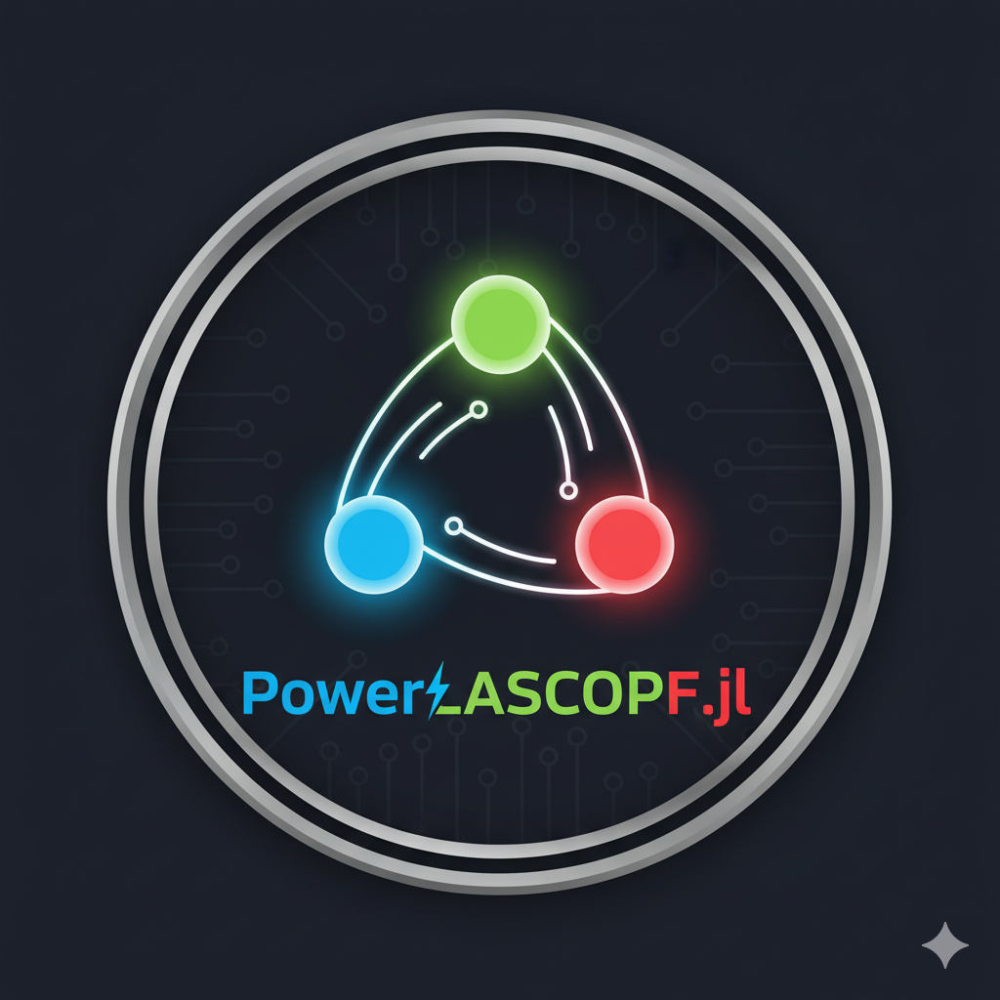

<div align="center">
  
  <h1>PowerLASCOPF.jl</h1>
</div>

# PowerLASCOPF.jl

*Look-Ahead Security-Constrained Optimal Power Flow in Julia*

[](https://github.com/yourusername/PowerLASCOPF.jl/actions)
[](LICENSE)

</div>

---

## Overview

PowerLASCOPF.jl is a Julia package for Look-Ahead Security-Constrained Optimal Power Flow (LASCOPF) built on NREL/Sienna's infrastructure:
- PowerSystems.jl (PSY)
- PowerSimulations.jl (PSI)
- InfrastructureSystems.jl (IS)

## Features

- 🔋 Security-constrained optimal power flow
- 🔮 Look-ahead optimization capabilities
- ⚡ Built on Sienna ecosystem
- 🚀 High-performance Julia implementation

## Installation
```julia
using Pkg
Pkg.add("PowerLASCOPF")