# Generator Subproblem Call Flow

This diagram traces the complete call chain for the distributed APP/ADMM generator
subproblems — from the top-level message-passing entry point in
`admm_app_solver.jl` down through each technology's component file and into the
solver primitives in `gensolver_first_base.jl`.

---

## Interactive Flowchart (Mermaid)

```mermaid
flowchart TD
    %% ── Entry point ─────────────────────────────────────────────────────────
    A(["`**admm_app_solver.jl**`"]):::file

    A --> B["gpower_angle_message!\n(gen::GeneralizedGenerator, …APP params…)"]:::fn
    B --> C["update_admm_parameters!\n(gen.gen_solver, Dict{…})"]:::fn
    C --> D["_dispatch_gen_subproblem!(gen)"]:::fn

    %% ── Technology dispatch ──────────────────────────────────────────────────
    D -- "GeneralizedGenerator\n{<:PSY.ThermalGen}"  --> E["solve_thermal_generator_subproblem!\n(gen::GeneralizedGenerator)"]:::fn
    D -- "GeneralizedGenerator\n{<:PSY.RenewableGen}" --> F["solve_renewable_generator_subproblem!\n(gen::GeneralizedGenerator)"]:::fn
    D -- "GeneralizedGenerator\n{<:PSY.HydroGen}"    --> G["solve_hydro_generator_subproblem!\n(gen::GeneralizedGenerator)"]:::fn
    D -- "GeneralizedGenerator\n{<:PSY.Storage}"     --> H["solve_storage_generator_subproblem!\n(gen::GeneralizedGenerator)"]:::fn

    %% ── admm_app_solver bridges to component overloads ──────────────────────
    E --> E2["solve_thermal_generator_subproblem!\n(gen.gen_solver, gen.generator::PSY.ThermalGen)"]:::fn
    F --> F2["solve_renewable_generator_subproblem!\n(gen.gen_solver, gen.generator::PSY.RenewableGen)"]:::fn
    G --> G2["solve_hydro_generator_subproblem!\n(gen.gen_solver, gen.generator::PSY.HydroGen)"]:::fn
    H --> H2["solve_storage_generator_subproblem!\n(gen.gen_solver, gen.generator::PSY.Storage)"]:::fn

    %% ── Component file boxes ─────────────────────────────────────────────────
    subgraph THERMAL ["ExtendedThermalGenerator.jl"]
        direction TB
        E2
        ET1["solve_thermal_generator_subproblem!\n(gen::ExtendedThermalGenerator)"]:::fn
        ET1a["update_thermal_solver_from_generator!(gen)"]:::helper
        ET1b["build_and_solve_gensolver_for_gen!\n(gen.gen_solver, gen.generator)"]:::fn
        ET1c["extract_thermal_results_to_generator!(gen, results)"]:::helper
        ET1d["update_thermal_performance!(gen)"]:::helper
        E2 --> ET1
        ET1 --> ET1a --> ET1b --> ET1c --> ET1d
    end

    subgraph RENEWABLE ["ExtendedRenewableGenerator.jl"]
        direction TB
        F2
        ER1["solve_renewable_generator_subproblem!\n(gen::ExtendedRenewableGenerator)"]:::fn
        ER1a["Sync GenFirstBaseInterval\n(Pg_prev, Pg_nu, Pg_nu_inner, Pg_next_nu)"]:::helper
        ER1b["build_and_solve_gensolver_for_gen!\n(gen.gen_solver, gen.generator)"]:::fn
        F2 --> ER1
        ER1 --> ER1a --> ER1b
    end

    subgraph HYDRO ["ExtendedHydroGenerator.jl"]
        direction TB
        G2
        EH1["solve_hydro_generator_subproblem!\n(gen::ExtendedHydroGenerator)"]:::fn
        EH1a["set_hydro_gen_data!(gen)"]:::helper
        EH1b["Sync GenFirstBaseInterval\n(Pg_prev, Pg_nu, Pg_nu_inner, Pg_next_nu)"]:::helper
        EH1c["build_and_solve_gensolver_for_gen!\n(gen.gen_solver, gen.generator)"]:::fn
        EH1d["update_hydro_performance!(gen)"]:::helper
        G2 --> EH1
        EH1 --> EH1a --> EH1b --> EH1c --> EH1d
    end

    subgraph STORAGE ["ExtendedStorageGenerator.jl"]
        direction TB
        H2
        ES1["solve_storage_generator_subproblem!\n(gen::ExtendedStorageGenerator)"]:::fn
        ES1a["Sync GenFirstBaseInterval\n(Pg_prev, Pg_nu, Pg_nu_inner, Pg_next_nu)"]:::helper
        ES1b["build_and_solve_gensolver_for_gen!\n(gen.gen_solver, gen.generator)"]:::fn
        ES1c["update_storage_performance!(gen, 1.0)"]:::helper
        H2 --> ES1
        ES1 --> ES1a --> ES1b --> ES1c
    end

    %% ── gensolver_first_base.jl ──────────────────────────────────────────────
    subgraph BASE ["gensolver_first_base.jl"]
        direction TB
        BF1["build_and_solve_gensolver_for_gen!\n(solver, device::PSY.ThermalGen)"]:::fn
        BF2["build_and_solve_gensolver_for_gen!\n(solver, device::PSY.StaticInjection)"]:::fn

        BF1 -- "use_preallocation = true" --> BP["build_and_solve_gensolver_preallocated_for_gen!\n(solver, device::PSY.ThermalGen)"]:::fn
        BF1 -- "use_preallocation = false" --> BD["Direct path\n(JuMP.Model)"]:::fn

        BP --> BP1["add_decision_variables_preallocated!"]:::helper
        BP --> BP2["add_constraints_preallocated!"]:::helper
        BP --> BP3["set_objective_preallocated!"]:::helper
        BP --> BP4["solve_gensolver_preallocated!"]:::helper

        BF2 --> BD2["Direct path\n(JuMP.Model)"]:::fn
        BD  --> BDv["add_decision_variables_direct!"]:::helper
        BD  --> BDc["add_constraints_direct!"]:::helper
        BD  --> BDo["set_objective_direct!"]:::helper
        BD  --> BDs["solve_gensolver_direct!"]:::helper
        BD2 --> BDv
        BD2 --> BDc
        BD2 --> BDo
        BD2 --> BDs
    end

    %% ── Cross-subgraph edges into BASE ────────────────────────────────────────
    ET1b --> BF1
    ER1b --> BF2
    EH1c --> BF2
    ES1b --> BF2

    %% ── Styles ───────────────────────────────────────────────────────────────
    classDef file   fill:#1e3a5f,color:#fff,stroke:#4a90d9,stroke-width:2px,font-weight:bold
    classDef fn     fill:#0d3349,color:#cde,stroke:#4a90d9,stroke-width:1.5px
    classDef helper fill:#1a2a1a,color:#afa,stroke:#4a4,stroke-width:1px,font-style:italic
```

---

## Call-Chain Summary Table

| Layer | Function | File | Notes |
|---|---|---|---|
| **Entry** | `gpower_angle_message!(gen::GeneralizedGenerator, …)` | `admm_app_solver.jl` | Maps APP params → `GenFirstBaseInterval` via `update_admm_parameters!` |
| **Dispatch** | `_dispatch_gen_subproblem!(gen)` | `admm_app_solver.jl` | One-liner multiple dispatch on `GeneralizedGenerator{<:PSY.*}` |
| **Bridge** | `solve_thermal_generator_subproblem!(gen::GeneralizedGenerator)` | `admm_app_solver.jl` | Unpacks `gen.gen_solver`, `gen.generator` |
| **Bridge** | `solve_renewable_generator_subproblem!(gen::GeneralizedGenerator)` | `admm_app_solver.jl` | Unpacks `gen.gen_solver`, `gen.generator` |
| **Bridge** | `solve_hydro_generator_subproblem!(gen::GeneralizedGenerator)` | `admm_app_solver.jl` | Unpacks `gen.gen_solver`, `gen.generator` |
| **Bridge** | `solve_storage_generator_subproblem!(gen::GeneralizedGenerator)` | `admm_app_solver.jl` | Unpacks `gen.gen_solver`, `gen.generator` |
| **Thermal component** | `solve_thermal_generator_subproblem!(gen::ExtendedThermalGenerator)` | `ExtendedThermalGenerator.jl` | Pre: `update_thermal_solver_from_generator!`; Post: `extract_thermal_results_to_generator!`, `update_thermal_performance!` |
| **Thermal dispatch** | `solve_thermal_generator_subproblem!(gen_solver, device::PSY.StaticInjection)` | `ExtendedThermalGenerator.jl` | Adds ramp / UC options; routes to `build_and_solve_gensolver_for_gen!` |
| **Renewable component** | `solve_renewable_generator_subproblem!(gen::ExtendedRenewableGenerator)` | `ExtendedRenewableGenerator.jl` | Syncs `GenFirstBaseInterval`; adds curtailment option |
| **Renewable dispatch** | `solve_renewable_generator_subproblem!(gen_solver, device::PSY.RenewableGen)` | `ExtendedRenewableGenerator.jl` | Adds curtailment option; routes to `build_and_solve_gensolver_for_gen!` |
| **Hydro component** | `solve_hydro_generator_subproblem!(gen::ExtendedHydroGenerator)` | `ExtendedHydroGenerator.jl` | Pre: `set_hydro_gen_data!`; syncs interval; Post: `update_hydro_performance!` |
| **Hydro dispatch** | `solve_hydro_generator_subproblem!(gen_solver, device::PSY.HydroGen)` | `ExtendedHydroGenerator.jl` | Adds water-flow / reservoir options; routes to `build_and_solve_gensolver_for_gen!` |
| **Storage component** | `solve_storage_generator_subproblem!(gen::ExtendedStorageGenerator)` | `ExtendedStorageGenerator.jl` | Syncs interval; Post: `update_storage_performance!` |
| **Storage dispatch** | `solve_storage_generator_subproblem!(gen_solver, device::PSY.Storage)` | `ExtendedStorageGenerator.jl` | Adds SoC / charge-discharge options; routes to `build_and_solve_gensolver_for_gen!` |
| **Solver (thermal)** | `build_and_solve_gensolver_for_gen!(solver, device::PSY.ThermalGen)` | `gensolver_first_base.jl` | Branches on `use_preallocation` |
| **Solver (fallback)** | `build_and_solve_gensolver_for_gen!(solver, device::PSY.StaticInjection)` | `gensolver_first_base.jl` | Always direct path (non-thermal) |
| **Preallocated path** | `build_and_solve_gensolver_preallocated_for_gen!` | `gensolver_first_base.jl` | `OptimizationContainer` + `add_*_preallocated!` + `solve_gensolver_preallocated!` |
| **Direct path** | JuMP model inline | `gensolver_first_base.jl` | `add_decision_variables_direct!` → `add_constraints_direct!` → `set_objective_direct!` → `solve_gensolver_direct!` |
